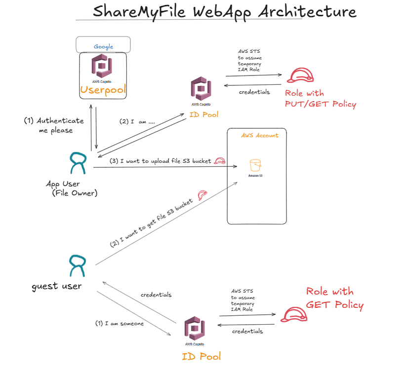

# CognitoCourse

# USER POOL APIs

# 1. To get OAuth Tokens using token endpoint

```
curl -X POST \
  https://<USERPOOL_DOMAIN_HERE>/oauth2/token \
  -H 'Content-Type: application/x-www-form-urlencoded' \
  -d 'grant_type=authorization_code&client_id=<CLIENT_ID_HERE>&code=<AUTHORIZATION_CODE_HERE>&redirect_uri=<REDIRECT_URI_HERE>'

  ```


# 2. API to Initiate Auth "USER_PASSWORD_AUTH"


```
curl --location --request POST 'https://cognito-idp.ap-south-1.amazonaws.com/' \
--header 'X-Amz-Target: AWSCognitoIdentityProviderService.InitiateAuth' \
--header 'Content-Type: application/x-amz-json-1.1' \
--data-raw '{
    "AuthParameters": {
        "USERNAME": ".....",
        "PASSWORD": "...."
           },
    "AuthFlow": "USER_PASSWORD_AUTH",
    "ClientId": "......"
}'
```

To change password  if user is logging in first time:-
```
curl --location --request POST 'https://cognito-idp.ap-south-1.amazonaws.com/' \
--header 'X-Amz-Target: AWSCognitoIdentityProviderService.RespondToAuthChallenge' \
--header 'Content-Type: application/x-amz-json-1.1' \
--data-raw '{
    "ChallengeName": "NEW_PASSWORD_REQUIRED",
    "ClientId": ".....",
    "ChallengeResponses": {"NEW_PASSWORD": ".....", "USERNAME": "...."},
      "Session": "..."

}'
```


# 3. API to Initiate Auth "USER_AUTH"
```
curl --location --request POST 'https://cognito-idp.ap-south-1.amazonaws.com/' \
--header 'X-Amz-Target: AWSCognitoIdentityProviderService.InitiateAuth' \
--header 'Content-Type: application/x-amz-json-1.1' \
--data-raw '{
    "AuthParameters": {
        "USERNAME": ".....",
       "PREFERRED_CHALLENGE": "EMAIL_OTP"
    },
    "AuthFlow": "USER_AUTH",
    "ClientId": "......."
}'

```

To verify OTP---->

```
curl --location --request POST 'https://cognito-idp.ap-south-1.amazonaws.com/' \
--header 'X-Amz-Target: AWSCognitoIdentityProviderService.RespondToAuthChallenge' \
--header 'Content-Type: application/x-amz-json-1.1' \
--data-raw '{
     "ChallengeName": "EMAIL_OTP", 
    "Session": "...",
    "ClientId": "....",
    "ChallengeResponses": {
        "USERNAME": "....",
        "EMAIL_OTP_CODE": "123456789"
    }
}'

```


# ID  POOL APIs

# 1. API to get ID
For guest user (unauthenticated random user)------>
```
curl -X POST https://cognito-identity.ap-south-1.amazonaws.com/ \
-H "Content-Type: application/x-amz-json-1.1" \
-H "X-Amz-Target: AWSCognitoIdentityService.GetId" \
-d '{
    "IdentityPoolId": "ap-south-1:...-...-...-..."
}'
```

For authenticated user (Cognito)------>
```
curl -X POST https://cognito-identity.ap-south-1.amazonaws.com/ \
-H "Content-Type: application/x-amz-json-1.1" \
-H "X-Amz-Target: com.amazonaws.cognito.identity.model.AWSCognitoIdentityService.GetId" \
-d '{
    "IdentityPoolId": "ap-south-1:...-...-...",
    "Logins": {
        "cognito-idp.<region>.amazonaws.com/<YOUR_USER_POOL_ID>": "ID_TOKEN"
    }
}'
```

# 2. API to get credentials for ID
```
curl -X POST https://cognito-identity.ap-south-1.amazonaws.com/ \
-H "Content-Type: application/x-amz-json-1.1" \
-H "X-Amz-Target: AWSCognitoIdentityService.GetCredentialsForIdentity" \
-d '{
    "IdentityId":".....",
    "Logins": {
        "cognito-idp.<region>.amazonaws.com/<YOUR_USER_POOL_ID>": "ID_TOKEN"
    }
}'
```

# 3. ID Pool with Google as identity provider
*  Create Google OAuth cient and use client ID to create Google as identity provider.
*  Use link to get authorization_code from Google https://accounts.google.com/o/oauth2/v2/auth?client_id=<enter-client-id-here>&redirect_uri=<enter-callback-url-here>&response_type=code&scope=openid 
*  Use authorization_code to get ID Token from Google:-
```
curl --location --request POST 'https://oauth2.googleapis.com/token?code=<enter-authorization_code-here>&grant_type=authorization_code&redirect_uri=<enter-callback-url-here>&client_id=<enter-client-id-here>&client_secret=<enter-client-secret-here>'
```
* Use ID Token from Google to create ID in Identity Pool and to get IAM credentials
```
curl -X POST https://cognito-identity.ap-south-1.amazonaws.com/ \
-H "Content-Type: application/x-amz-json-1.1" \
-H "X-Amz-Target: com.amazonaws.cognito.identity.model.AWSCognitoIdentityService.GetId" \
-d '{
    "IdentityPoolId": "ap-south-1:...-...-...",
    "Logins": {
        "accounts.google.com": "..."
    }
}'
```
```
curl -X POST https://cognito-identity.ap-south-1.amazonaws.com/ \
-H "Content-Type: application/x-amz-json-1.1" \
-H "X-Amz-Target: AWSCognitoIdentityService.GetCredentialsForIdentity" \
-d '{
    "IdentityId":".....",
    "Logins": {
        "accounts.google.com": ""
    }
}'
```
# GoogleAuth Platform
URL:- https://console.cloud.google.com/auth

# Medium Articles:-
* Cognito userpool integration with Google:- https://awskarthik82.medium.com/how-to-integrate-aws-cognito-with-google-social-login-fd379ff644cc

* Cognito identitypool integration with Google:- https://medium.com/@shivkaundal/integrating-google-as-an-identity-provider-with-aws-cognito-identity-pools-a-step-by-step-guide-81fed5b3fb3c

https://console.cloud.google.com/auth

---------------------------------------------------------------------------------------------------------------------
# ShareMyFile WebApp Architecture


